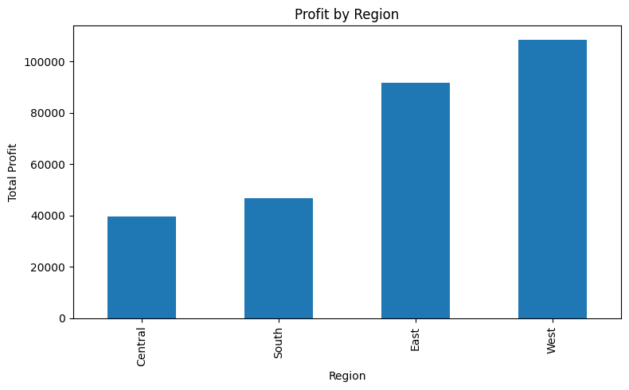
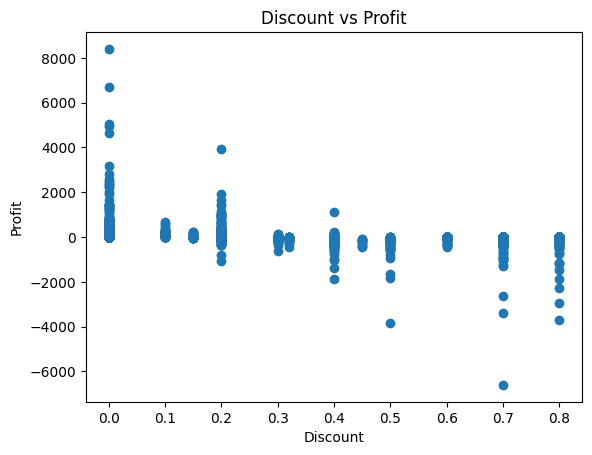

# 📊 Sales Data Analysis Project

## 🎯 Objective
Analyze retail sales data to identify trends, understand profitability, and generate insights to support business decision-making.

---

## 🧰 Tools & Technologies
- Python
- Pandas
- Matplotlib
- Jupyter Notebook

---

## 📂 Dataset
- Superstore Sales Dataset (Retail Data)
- Contains: Order Date, Category, Sales, Profit, Discount, Region

---

## 🔍 Key Analysis Performed
- Sales distribution by category
- Profit analysis by region
- Monthly sales trends
- Top-performing products
- Loss-making products identification
- Discount impact on profit

---

## 📊 Key Insights
- High discounts negatively impact profitability
- A few products contribute most of the revenue
- Some products consistently generate losses
- Profit varies significantly across regions
- Sales show seasonal trends

---

## 💡 Business Impact
This analysis helps businesses:
- Optimize pricing strategies
- Reduce losses from discounting
- Focus on high-performing products
- Improve overall profitability

---

## 📊 Sample Visualizations

### Sales by Category
![Sales] (Sales_by_category.png)

### Profit by Region

### Discount vs Profit

## 🧠 Conclusion
The project highlights how data-driven insights can improve business decisions by identifying key factors affecting sales and profit.

---

## 🚀 How to Run
1. Download the dataset
2. Open the notebook (`sales_data_analysis.ipynb`)
3. Run all cells

---

## 🔗 Project Files
- Notebook: `sales_data_analysis.ipynb`
- Dataset: `data.csv`
